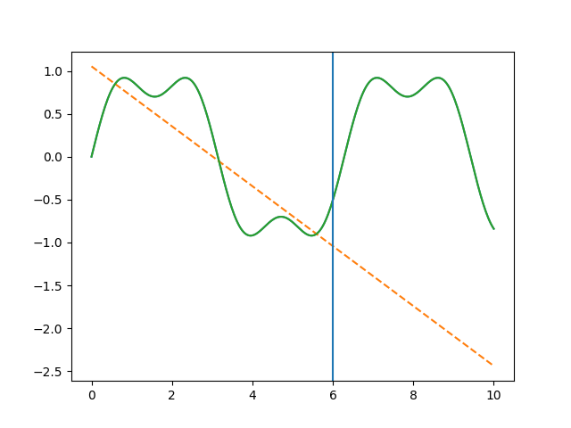
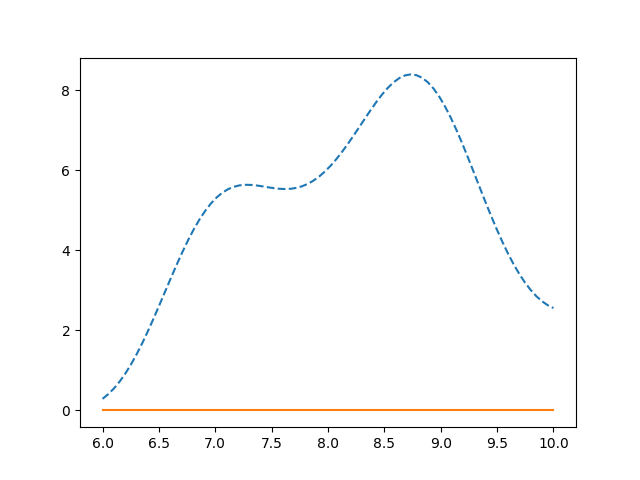

# I2OS Resonance Extrapolation

## Structure Enables Extrapolation

> A minimal experiment showing that **extrapolation is governed by structure—not data volume.**

---

## 📊 Result





---

## 🔥 Core Result

* A linear model fails immediately outside the training domain
* A resonance-based model preserves structure and continues to track the true function

---

## ⚡ Key Insight

Extrapolation is not a data problem.

It is a structure problem.

---

## 🧠 Overview

Traditional machine learning models rely on:

* large datasets
* interpolation
* optimization

However, this paradigm breaks down when:

* data is limited
* the domain is unseen
* the structure is nonlinear

This repository demonstrates a minimal but fundamental result:

> **When structural resonance is encoded, extrapolation becomes possible—even under low-data conditions.**

---

## 🧪 Experiment

### Target Function

[
y = \sin(x) + 0.3 \sin(3x)
]

---

### Training Region

[
x \in [0,6]
]

---

### Extrapolation Region

[
x \in [6,10]
]

---

## 🤖 Models

### Baseline Model

Linear regression:

[
y = ax + b
]

* captures only linear trend
* fails immediately outside training domain

---

### Resonance Model

Feature transformation:

[
\phi(x) =
[
\sin x,\cos x,
\sin 2x,\cos 2x,
\sin 3x,\cos 3x
]
]

* encodes periodic structure
* preserves behavior beyond training region

---

## 📈 Results

### Figure 1 – Extrapolation Behavior

* Baseline diverges outside training domain
* Resonance model follows the true function

---

### Figure 2 – Error Comparison

* Baseline accumulates large error
* Resonance model maintains low, stable error

---

## ⚙️ How to Run

```bash
pip install numpy matplotlib scikit-learn
python experiment.py
```

---

## 📦 Output

* `figure1.png` – behavior comparison
* `figure2.png` – error comparison
* reproducible minimal experiment

---

## ⚙️ I2OS Perspective

This experiment is grounded in the I2OS principle:

[
I = (\nabla M) \otimes R
]

Where:

* ( \nabla M ): structural gradient
* ( R ): resonance

Meaning:

> **Intelligence = structure × resonance**

---

## 🌐 Interpretation

```
Baseline:
  Data fitting → interpolation

Resonance:
  Structure encoding → extrapolation
```

---

## 🚀 Implications

This work suggests a shift in AI design:

```
From:
  Data-driven optimization

To:
  Structure-driven generalization
```

---

## 🔗 Relevance

This direction connects:

* Quantum Machine Learning
* Low-data scientific modeling
* Structure-based intelligence (I2OS)

---

## 📄 Paper

Full paper:

👉 [paper.pdf](./paper.pdf)

---

## 👤 Author

Masayuki Ando

---

## 📜 License

MIT License
